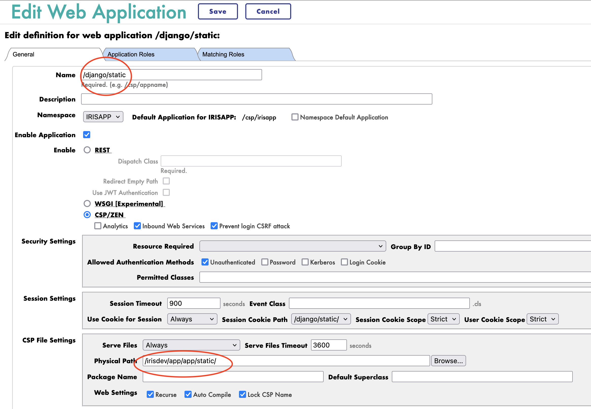

# iris-django-template


## Description

This is a template for an Django application that can be deployed in IRIS as an native Web Application.

## Installation

1. Clone the repository
2. Create a virtual environment
3. Install the requirements
4. Run the docker-compose file

```bash
git clone
cd iris-django-template
python3 -m venv .venv
source .venv/bin/activate
pip install -r requirements.txt
docker-compose up
```

## Usage

The base URL is `http://localhost:53795/django/`.

### Endpoints

- `/iris` - Returns a JSON object with the top 10 classes present in the IRISAPP namespace.
- `/interop` - A ping endpoint to test the interoperability framework of IRIS.
- `/api/posts` - A simple CRUD endpoint for a Post object.
- `/api/comments` - A simple CRUD endpoint for a Comment object.

## How to develop from this template

See WSGI introduction article: [wsgi-introduction](https://community.intersystems.com/post/wsgi-support-introduction).

TL;DR : You can toggle the `DEBUG` flag in the Security portal to make changes to be reflected in the application as you develop.

## Code presentation

The Django application is structured as follows:

- `app` - Django project folder
  - `app` - Django app folder for configuration
    - `settings.py` - Django settings file
    - `urls.py` - Django URL configuration file to connect the views to the URLs
    - `wsgi.py` - Django WSGI file
    - `asgi.py` - Django ASGI file
  - `community` - Django app folder for the community app, crud on Post and Comment objects
    - `models.py` - Django models file for the Post and Comment objects
    - `views.py` - Django views file to access the Post and Comment objects
    - `serializers.py` - Django serializers file for the Post and Comment objects
    - `admin.py` - Django admin file add crud to the admin interface
    - `migrations` - Django migrations folder to build the database
    - `fixtures` - Django fixtures folder demo data 
  - `sqloniris` - Django app folder for the SQL on IRIS app
    - `views.py` - Django views file to query the IRISAPP namespace
    - `apps.py` - Django app configuration file
  - `interop` - Django app folder for the interoperability app
    - `views.py` - Django views file to test the interoperability framework
    - `apps.py` - Django app configuration file
  - `manage.py` - Django management file

### `app/settings.py`

This file contains the Django settings for the application.

```python
...

# Application definition

INSTALLED_APPS = [
    'django.contrib.admin',
    'django.contrib.auth',
    'django.contrib.contenttypes',
    'django.contrib.sessions',
    'django.contrib.messages',
    'django.contrib.staticfiles',
    'community',
    'sqloniris',
    'interop',
    'rest_framework'
]

...

REST_FRAMEWORK = {
    # Use Django's standard `django.contrib.auth` permissions,
    # or allow read-only access for unauthenticated users.
    'DEFAULT_PERMISSION_CLASSES': [
        'rest_framework.permissions.DjangoModelPermissionsOrAnonReadOnly'
    ],
    'DEFAULT_PAGINATION_CLASS': 'rest_framework.pagination.LimitOffsetPagination',
    'PAGE_SIZE': 20
}

...

DATABASES = {
    "default": {
        "ENGINE": "django_iris",
        "EMBEDDED": True,
        "NAMESPACE": "IRISAPP",
        "USER":"SuperUser",
        "PASSWORD":"SYS",
    }
}
```

Few important settings to note:

- `INSTALLED_APPS` - Contains the list of installed apps in the Django project.
  - `community` - The Django app for the CRUD operations on the Post and Comment objects.
  - `sqloniris` - The Django app for the SQL on IRIS operations.
  - `interop` - The Django app for the interoperability operations.
  - `rest_framework` - The Django REST framework for the REST API.
- `REST_FRAMEWORK` - Contains the settings for the Django REST framework.
  - `DEFAULT_PERMISSION_CLASSES` - Only authenticated users can perform CRUD operations.
  - `DEFAULT_PAGINATION_CLASS` - The pagination class for the REST API.
- `DATABASES` - Contains the settings for the IRIS database connection.
  - Here we are using the `django_iris` engine to connect to the IRIS database.

### `app/urls.py`

This file contains the URL configuration for the Django application.

```python
from django.contrib import admin
from django.urls import path,include
from rest_framework import routers
from community.views import PostViewSet, CommentViewSet
from sqloniris.views import index
from interop.views import index as interop_index

router = routers.DefaultRouter()
router.register(r'posts', PostViewSet)
router.register(r'comments', CommentViewSet)


urlpatterns = [
    path('admin/', admin.site.urls),
    path('api/', include(router.urls)),
    path('iris/', index),
    path('interop/', interop_index)
]
```

- `router` - Contains the default router for the REST API.
- `routeer.register` - Registers the Post and Comment viewsets to the router.
- `urlpatterns` - Contains the URL patterns for the Django application.
  - `/admin/` - The Django admin interface.
  - `/api/` - The REST API for the Post and Comment objects.
  - `/iris/` - The SQL on IRIS endpoint.
  - `/interop/` - The interoperability endpoint.

### `app/wsgi.py`

This file contains the WSGI configuration for the Django application.

This is the file that we have to provide to IRIS to run the Django application.

In the `Security->Applications->Web Applications` section, we have to provide the path to this file.

- **Application Name**
  - `app.wsgi`
- **Callable Name**
  - `application`
- **WSGI App directory**
  - `/irisdev/app/app`

### `community/models.py`

This file contains the Django models for the Post and Comment objects.

```python
from django.db import models

# Create your models here.
class Post(models.Model):
    title = models.CharField(max_length=100)
    content = models.TextField()

class Comment(models.Model):
    content = models.TextField()
    post = models.ForeignKey(Post, on_delete=models.CASCADE, related_name='comments')
```

- `Post` - The model for the Post object.
  - `title` - The title of the post.
  - `content` - The content of the post.
- `Comment` - The model for the Comment object.
  - `content` - The content of the comment.
  - `post` - The foreign key to the Post object.
  - `related_name` - The related name for the comments.

### `community/seializers.py`

This file contains the Django serializers for the Post and Comment objects.

Using the Django REST framework, we can serialize the Django models to JSON objects.

```python
from rest_framework import serializers
from community.models import Post, Comment

class PostSerializer(serializers.ModelSerializer):
    class Meta:
        model = Post
        fields = ('id', 'title', 'content', 'comments')

class CommentSerializer(serializers.ModelSerializer):
    class Meta:
        model = Comment
        fields = ('id', 'content', 'post')
```

- `PostSerializer` - The serializer for the Post object.
- `CommentSerializer` - The serializer for the Comment object.
- `fields` - The fields to be serialized.

### `community/views.py`

This file contains the Django views for the Post and Comment objects.

Using the Django REST framework, we can create CRUD operations for the Django models.

```python
from django.shortcuts import render
from rest_framework import viewsets

# Import the Post and Comment models
from community.models import Post, Comment

# Import the Post and Comment serializers
from community.serializers import PostSerializer, CommentSerializer

# Create your views here.
class PostViewSet(viewsets.ModelViewSet):
    queryset = Post.objects.all()
    serializer_class = PostSerializer

class CommentViewSet(viewsets.ModelViewSet):
    queryset = Comment.objects.all()
    serializer_class = CommentSerializer
```

- `PostViewSet` - The viewset for the Post object.
- `CommentViewSet` - The viewset for the Comment object.
- `queryset` - The queryset for the viewset.
- `serializer_class` - The serializer class for the viewset.

### `sqloniris/views.py`

This file contains the Django views for the SQL on IRIS operations.

```python
from django.http import JsonResponse

import iris

def index(request):
    query = "SELECT top 10 * FROM %Dictionary.ClassDefinition"
    rs = iris.sql.exec(query)
    # Convert the result to a list of dictionaries
    result = []
    for row in rs:
        result.append(row)
    return JsonResponse(result, safe=False)
```

- `index` - The view for the SQL on IRIS operation.
- `query` - The SQL query to be executed on the IRIS database.
- `rs` - The result set from the query.
- `result` - The list of list from the result set.
- `JsonResponse` - The JSON response for the view, safe is set to False to allow list of list.

### `interop/views.py`

This file contains the Django views for the interoperability operations.

```python
from django.http import HttpResponse

from iop import Director

bs = Director.create_python_business_service('BS')

def index(request):
    result = bs.on_process_input(request)
    return HttpResponse(result, safe=False)
```

- `bs` - The business service object created using the `Director` class.
- `index` - The view for the interoperability operation.
- `result` - The result from the business service.

NB : we don't use `JsonResponse` to simplify the code, we can use it if we want to return a JSON object.

## Troubleshooting

### How to run the Django application in a standalone mode

To run the Django application in a standalone mode, we can use the following command:

```bash
cd /irisdev/app/app
python3 manage.py runserver 8001
```

This will run the Django application on the default port `8001`.


NB : You must be inside of the container to run this command.

```bash
docker exec -it iris-django-template-iris-1 bash
```

### Restart the application in IRIS

Be in `DEBUG` mode make multiple calls to the application, and the changes will be reflected in the application.

### How to access the IRIS Management Portal

You can access the IRIS Management Portal by going to `http://localhost:53795/csp/sys/UtilHome.csp`.

### Run this template locally

For this you need to have IRIS installed on your machine.

Next you need to create a namespace named `IRISAPP`.

Install the requirements.

```bash
# Move to the app directory
cd /irisdev/app/app

# python manage.py flush --no-input
python3 manage.py migrate
# create superuser
export DJANGO_SUPERUSER_PASSWORD=SYS
python3 manage.py createsuperuser --no-input --username SuperUser --email admin@admin.fr

# load demo data
python3 manage.py loaddata community/fixtures/demo.json

# collect static files
python3 manage.py collectstatic --no-input --clear

# init iop
iop --init

# load production
iop -m /irisdev/app/app/interop/settings.py

# start production
iop --start Python.Production
```

### How to serve static files

To serve the static files in the Django application, we can use the following command:

```bash
cd /irisdev/app
python3 manage.py collectstatic
```

This will collect the static files from the Django application and serve them in the `/irisdev/app/static` directory.

To publish the static files in IRIS, configure the `Security->Applications->Web Applications` section.

